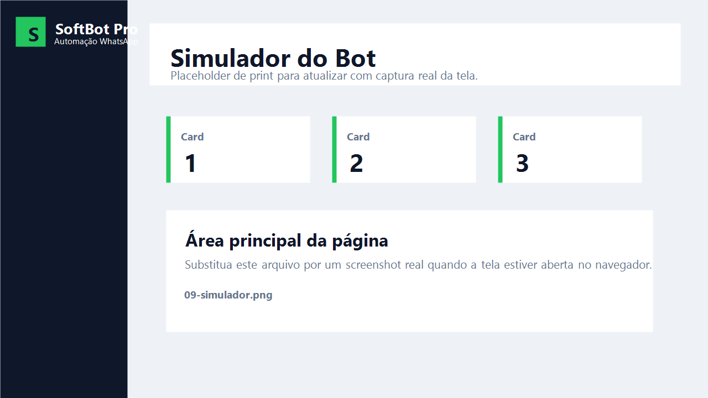
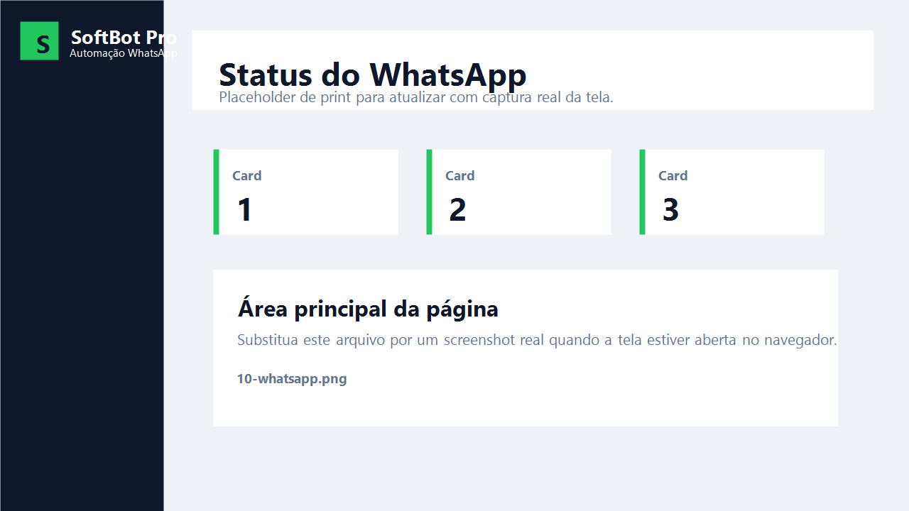
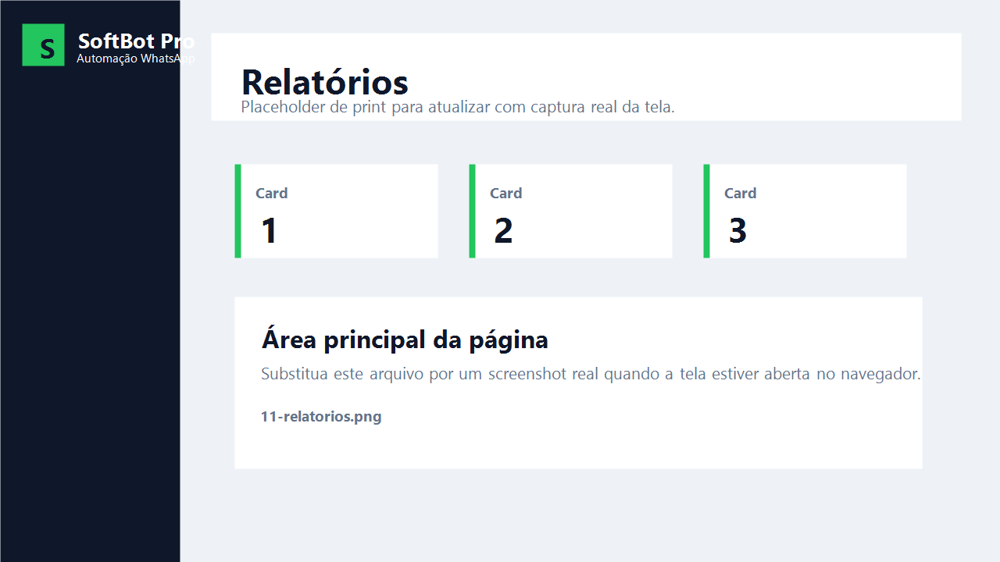
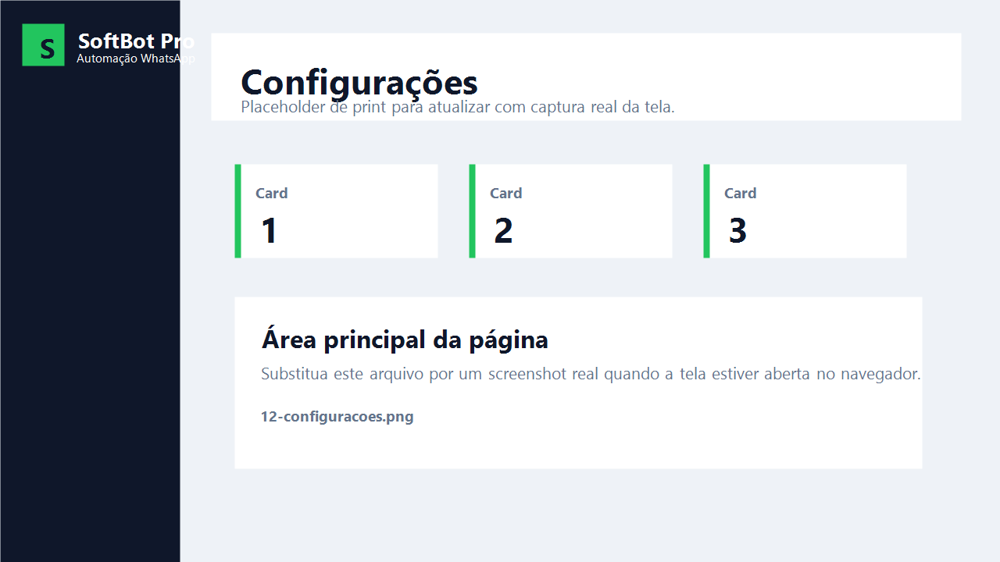
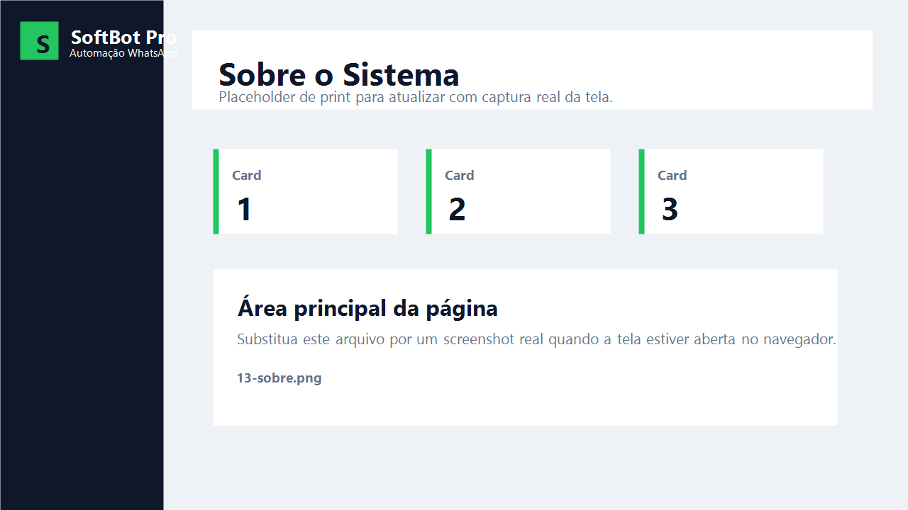
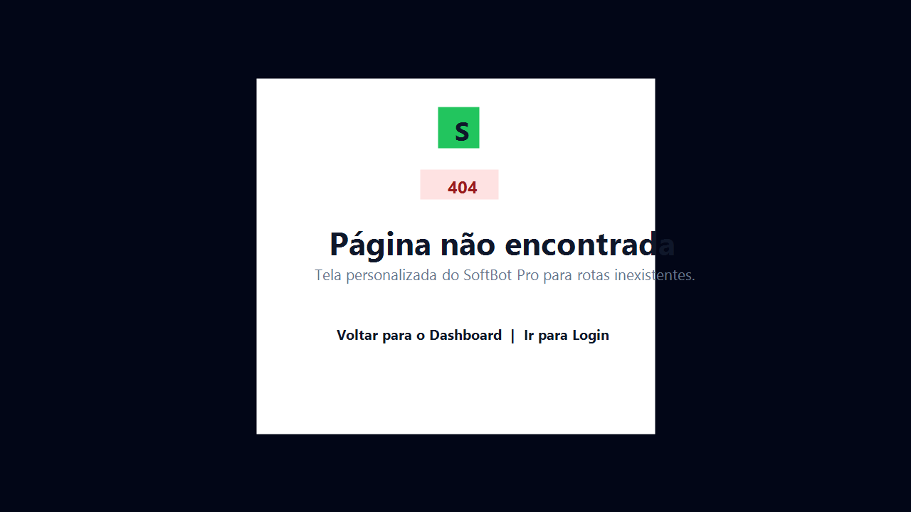

# SoftBot Pro WhatsApp

> Projeto funcional de automação de atendimento com painel administrativo, API em FastAPI e estrutura preparada para integração com WhatsApp Cloud API.

Sistema de automação de atendimento inspirado em WhatsApp Business, desenvolvido com Python, FastAPI, SQLite/PostgreSQL, HTML, CSS e JavaScript.

O projeto simula um bot de atendimento para uma empresa de software, permitindo responder mensagens automaticamente, cadastrar perguntas frequentes, acompanhar histórico de mensagens, gerenciar status de atendimento e controlar usuários do painel administrativo.

---

## Status do projeto

O **SoftBot Pro WhatsApp** está funcional como sistema web de automação e atendimento.

O projeto conta com:

- API em FastAPI hospedada no Render;
- Front-end hospedado no GitHub Pages;
- Login com autenticação;
- Painel administrativo;
- Cadastro e gerenciamento de usuários;
- Cadastro de FAQs;
- Simulador de mensagens;
- Histórico de atendimentos;
- Filtros e busca;
- Relatórios;
- Página de configurações;
- Página de status da integração WhatsApp;
- Webhook preparado para WhatsApp Cloud API;
- Recebimento de mensagens reais via webhook;
- Processamento automático das mensagens recebidas;
- Registro das mensagens no banco de dados;
- Logs de envio e status das mensagens.

---

## Objetivo do projeto

O objetivo do SoftBot Pro WhatsApp é criar uma base profissional para automação de atendimento via WhatsApp, com foco em:

- simulação de mensagens recebidas;
- respostas automáticas;
- gerenciamento de perguntas frequentes;
- histórico de atendimentos;
- controle de status das mensagens;
- login com autenticação JWT;
- usuários com perfis diferentes;
- preparação para integração futura com WhatsApp Business Platform.

---

## Tecnologias utilizadas

### Back-end

- Python
- FastAPI
- Uvicorn
- SQLite
- PostgreSQL preparado
- SQLAlchemy
- Pydantic
- PyJWT
- python-dotenv
- requests

### Front-end

- HTML
- CSS
- JavaScript

### Ferramentas

- VS Code
- Git
- GitHub
- Swagger UI / FastAPI Docs

---

## Funcionalidades

### Bot e mensagens

- Simulação de mensagem recebida pelo WhatsApp
- Rota `/webhook` para processar mensagens simuladas
- Respostas automáticas
- Respostas com base em FAQs cadastradas
- Histórico de mensagens
- Status de atendimento

### FAQs

- Cadastro de perguntas frequentes
- Listagem de FAQs
- Exclusão de FAQs
- Respostas automáticas por palavra-chave

### Mensagens

- Listagem de mensagens recebidas
- Exclusão de mensagens
- Limpeza de histórico
- Alteração de status
- Busca e filtro por status

### Usuários

- Criação de usuários
- Listagem de usuários
- Edição de nome, username e perfil
- Exclusão de usuários
- Alteração de senha
- Busca e filtro por perfil
- Perfis: admin, atendente e suporte

### Perfil do usuário logado

- Visualização de nome, username, perfil e data de criação
- Alteração da própria senha

### Simulador

- Envio de mensagens de teste para o bot
- Resposta automática em tempo real
- Mensagens rápidas para teste
- Registro automático no histórico

### Relatórios

- Resumo geral de mensagens
- Total de FAQs
- Total de usuários
- Taxa de resolução
- Distribuição por status
- Últimas mensagens registradas

### Configurações

- Status da API
- Status do banco de dados
- Informações do ambiente
- URL da API usada pelo front-end
- Diagnóstico da integração WhatsApp

### Sobre

- Apresentação do projeto
- Tecnologias utilizadas
- Funcionalidades principais
- Próximas melhorias
- Informações do autor

### Página 404

- Página personalizada para erro de rota ou página não encontrada
- Botão para voltar ao Dashboard
- Botão para voltar ao Login
- Visual integrado ao design do SoftBot Pro

---

## Prints do projeto

### Simulador do Bot

Página para testar o atendimento automático sem depender do Swagger ou do WhatsApp real.



---

### Status do WhatsApp

Página de diagnóstico da integração com WhatsApp Business Platform, mostrando modo atual, token, Phone Number ID e Verify Token.



---

### Relatórios

Tela com resumo de mensagens, usuários, FAQs, taxa de resolução e distribuição por status.



---

### Configurações

Painel de diagnóstico geral com status da API, banco, ambiente, URL da API e informações do sistema.



---

### Sobre o Sistema

Página explicando o objetivo do projeto, tecnologias usadas, funcionalidades principais e próximas melhorias.



---

### Página 404

Tela personalizada para páginas não encontradas.



---

## Permissões por perfil

### Admin

O usuário admin pode:

- acessar todas as páginas;
- criar usuários;
- editar usuários;
- excluir usuários;
- alterar senha de usuários;
- criar FAQs;
- excluir FAQs;
- excluir mensagens;
- limpar histórico;
- alterar status;
- visualizar mensagens e FAQs.

### Atendente

O usuário atendente pode:

- visualizar mensagens;
- alterar status;
- visualizar FAQs.

O atendente não pode:

- gerenciar usuários;
- criar ou excluir FAQs;
- excluir mensagens;
- limpar histórico.

### Suporte

O usuário suporte pode:

- visualizar mensagens;
- alterar status;
- visualizar FAQs.

O suporte não pode:

- gerenciar usuários;
- criar ou excluir FAQs;
- excluir mensagens;
- limpar histórico.

---

## Integração com WhatsApp

A integração com a **WhatsApp Cloud API** foi preparada no projeto e testada tecnicamente.

Durante os testes, o sistema conseguiu:

- validar o webhook com a Meta;
- receber mensagens reais enviadas pelo WhatsApp;
- processar a mensagem recebida;
- gerar uma resposta automática;
- salvar a mensagem no painel;
- enviar a requisição de resposta para a API da Meta;
- capturar o status de entrega retornado pela Meta.

Porém, a entrega final da resposta no WhatsApp não foi concluída por uma restrição externa da conta empresarial utilizada nos testes.

Erro retornado pela Meta:

```text
Business account is restricted from messaging users in this country.
```

Portanto, o sistema está pronto tecnicamente para integração com WhatsApp, mas a vinculação final depende de uma conta empresarial WhatsApp Business liberada para envio no país/região do destinatário.

## Observação importante

Este projeto foi publicado como uma versão funcional para estudo, portfólio e demonstração técnica.

A integração com WhatsApp real está estruturada no código, mas pode exigir:

- conta empresarial verificada;
- número oficial configurado na WhatsApp Business Platform;
- permissões liberadas pela Meta;
- token permanente;
- configuração completa no WhatsApp Manager.

---

## Principais rotas da API

### Sistema

```text
GET /
GET /health
GET /info
```

### Autenticação

```text
POST /login
```

### Mensagens

```text
POST /webhook
GET /mensagens
PUT /mensagens/{mensagem_id}/status
DELETE /mensagens/{mensagem_id}
DELETE /mensagens
```

### FAQs

```text
POST /faqs
GET /faqs
DELETE /faqs/{faq_id}
```

### Usuários

```text
POST /usuarios
GET /usuarios
PUT /usuarios/{usuario_id}
PUT /usuarios/{usuario_id}/senha
DELETE /usuarios/{usuario_id}
GET /me
PUT /me/senha
```

### WhatsApp

```text
GET /whatsapp/webhook
POST /whatsapp/webhook
```

---

## Deploy no Render

Build command:

```bash
pip install -r requirements.txt
```

Start command:

```bash
python -m uvicorn app.main:app --host 0.0.0.0 --port $PORT
```

O projeto também possui:

```text
Procfile
start.sh
.env.example
DEPLOY_RENDER.md
```

SQLite funciona para teste inicial no Render, mas para produção o recomendado é usar PostgreSQL e configurar `DATABASE_URL`.

---

## Estrutura de pastas

```text
softbot-pro-whatsapp/
├── app/
│   ├── main.py
│   ├── database.py
│   ├── models.py
│   ├── schemas.py
│   ├── bot.py
│   ├── crud.py
│   ├── auth.py
│   ├── config.py
│   └── whatsapp_service.py
├── frontend/
│   ├── login.html
│   ├── index.html
│   ├── mensagens.html
│   ├── faq.html
│   ├── usuarios.html
│   ├── perfil.html
│   ├── config.js
│   ├── style.css
│   └── script.js
├── tests/
│   ├── payload_whatsapp_texto.json
│   └── payload_whatsapp_imagem.json
├── docs/
├── .env.example
├── .gitignore
├── DEPLOY_RENDER.md
├── Procfile
├── requirements.txt
├── start.sh
└── README.md
```

---

## Próximas melhorias

- Configurar conta empresarial verificada na Meta;
- Vincular número oficial à WhatsApp Business Platform;
- Criar token permanente para produção;
- Finalizar envio real de mensagens pelo WhatsApp;
- Migrar SQLite para PostgreSQL em produção;
- Melhorar relatórios com gráficos;
- Criar página de auditoria de mensagens;
- Adicionar paginação nas tabelas;
- Melhorar responsividade mobile.
